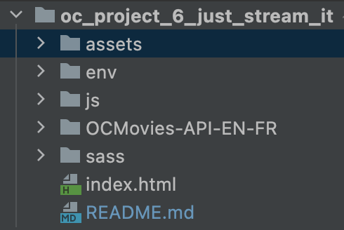

<div id="top"></div>

<!-- PROJECT SHIELDS -->
<!--
*** I'm using markdown "reference style" links for readability.
*** Reference links are enclosed in brackets [ ] instead of parentheses ( ).
*** See the bottom of this document for the declaration of the reference variables
*** for contributors-url, forks-url, etc. This is an optional, concise syntax you may use.
*** https://www.markdownguide.org/basic-syntax/#reference-style-links
-->
[![oc][oc-project-shield]][oc-project-url]
[![web-development][web-development-shield]][web-development-url]
[![responsive][responsive-design-shield]][responsive-design-url]
[![fetch][fetch-api-shield]][fetch-api-url]
[![async][async-await-shield]][async-await-url]


<!-- PROJECT LOGO -->
<br />
<div align="center">

<h1 align="center">OC - PROJECT N°6 - User Interface for Python web application</h1>

  <p align="center">
    Movies web application listing top rated movies for different categories (science fiction, animation, comedy). Data retrieve from an
<a href="https://github.com/OpenClassrooms-Student-Center/OCMovies-API-EN-FR"><small>API.</small></a>
<br/>
    </p>
</div>

<a href="https://unsplash.com/fr/photos/PGuCnUzsRSM"><small>By Tech Daily</small></a>


<!-- ABOUT THE PROJECT -->

## About The Project

### Desktop version


### Tablet version


### Mobile Version


<p align="right">(<a href="#top">back to top</a>)</p>

### Built With

* HTML
* CSS & SASS
* JavaScript
* Python
* API from https://github.com/OpenClassrooms-Student-Center/OCMovies-API-EN-FR

<p align="right">(<a href="#top">back to top</a>)</p>


<!-- GETTING STARTED -->

## Getting Started

### Installation & Running the script

1. Clone the repo
   ```sh
   git clone https://github.com/Jliezed/oc_project_6_just_stream_it.git
   ```
   ```sh
   git clone clone https://github.com/OpenClassrooms-Student-Center/OCMovies-API-EN-FR.git
   ```
2. Place the folder "OCMovies-API-EN-FR" inside "oc_project_6_just_stream_it"
   

#### Create and activate a virtual environment

2. Go to your project directory
   ```sh
   cd ocmovies-api-en
   ```
3. Install venv library (if not yet in your computer)
   ```sh
   pip install venv
   ```
4. Create a virtual environment
   ```sh
   python -m venv env
   ```
5. Activate the virtual environment
   ```sh
   source env/bin/activate
   ```

---

#### Install packages

6. Install the packages using requirements.txt
   ```sh
   pip install -r requirements.txt
   ```

#### Run the program

7. Run the script using the terminal
   ```sh
   python manage.py runserver
   ```

---


<p align="right">(<a href="#top">back to top</a>)</p>


<!-- MARKDOWN LINKS & IMAGES -->
<!-- https://www.markdownguide.org/basic-syntax/#reference-style-links -->

[oc-project-shield]: https://img.shields.io/badge/OPENCLASSROOMS-PROJECT-blueviolet?style=for-the-badge
[oc-project-url]: https://openclassrooms.com/fr/paths/518-developpeur-dapplication-python

[responsive-design-shield]: https://img.shields.io/badge/-RESPONSIVE%20DESIGN-blue?style=for-the-badge
[responsive-design-url]: https://en.wikipedia.org/wiki/Responsive_web_design

[fetch-api-shield]: https://img.shields.io/badge/-FETCH%20API-blue?style=for-the-badge
[fetch-api-url]: https://developer.mozilla.org/en-US/docs/Web/API/Fetch_API

[async-await-shield]: https://img.shields.io/badge/-ASYNC%20AWAIT-blue?style=for-the-badge
[async-await-url]: https://developer.mozilla.org/en-US/docs/Web/JavaScript/Reference/Statements/async_function

[web-development-shield]: https://img.shields.io/badge/-WEB%20DEVELOPMENT-blue?style=for-the-badge
[web-development-url]: https://en.wikipedia.org/wiki/Web_development